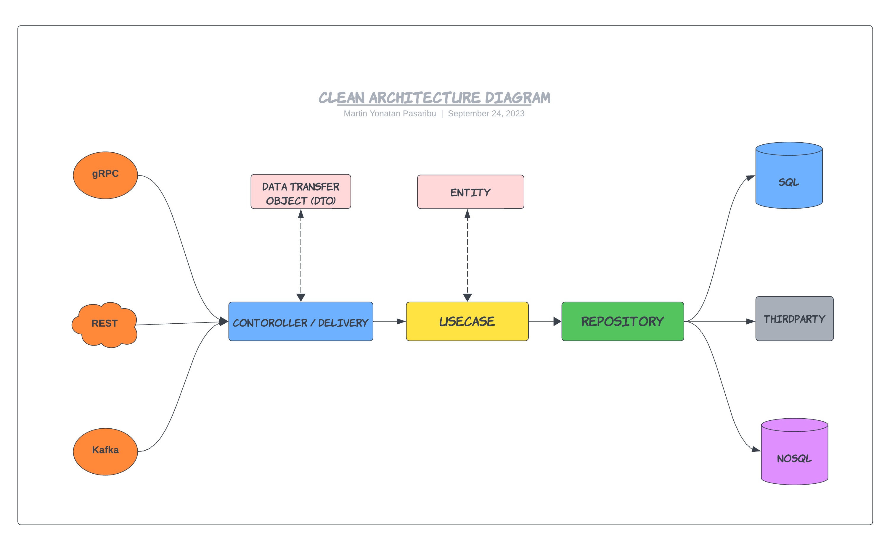

## Golang Clean Architecture

This is an example of implementation of Clean Architecture with S.O.L.I.D Principles in Go (Golang) projects.

Rule of Clean Architecture by Uncle Bob

- Independent of Frameworks. The architecture does not depend on the existence of some library of feature laden software. This allows you to use such frameworks as tools, rather than having to cram your system into their limited constraints.
- Testable. The business rules can be tested without the UI, Database, Web Server, or any other external element.
- Independent of UI. The UI can change easily, without changing the rest of the system. A Web UI could be replaced with a console UI, for example, without changing the business rules.
- Independent of Database. You can swap out Oracle or SQL Server, for Mongo, BigTable, CouchDB, or something else. Your business rules are not bound to the database.
- Independent of any external agency. In fact your business rules simply don’t know anything at all about the outside world.

More at https://8thlight.com/blog/uncle-bob/2012/08/13/the-clean-architecture.html

## 🔍 What S.O.L.I.D Principle is?

SOLID is an acronym representing five essential design principles for writing maintainable and scalable software. These principles were introduced by Robert C. Martin (Uncle Bob) and have become fundamental guidelines for good software design.

### SOLID Principles

#### Single Responsibility Principle (SRP)

The SRP states that a class should have only one reason to change, meaning it should have a single, well-defined responsibility. This principle encourages the separation of concerns, making code more modular and easier to maintain.

#### Open/Closed Principle (OCP)

The OCP emphasizes that software entities (classes, modules, functions) should be open for extension but closed for modification. To achieve this, use abstractions (e.g., interfaces, abstract classes) and dependency injection to allow adding new functionality without altering existing code.

#### Liskov Substitution Principle (LSP)

The LSP states that objects of a derived class should be substitutable for objects of the base class without affecting the correctness of the program. In other words, derived classes must adhere to the contract defined by their base classes.

#### Interface Segregation Principle (ISP)

The ISP suggests that clients should not be forced to depend on interfaces they do not use. Create smaller, more focused interfaces rather than large, monolithic ones. This avoids unnecessary dependencies and promotes flexibility.

#### Dependency Inversion Principle (DIP)

The DIP promotes high-level modules (e.g., use cases) to depend on abstractions (e.g., interfaces) rather than concrete implementations. This inversion of dependencies allows for flexibility and testability by injecting dependencies from external sources.

### Benefits of SOLID Principles

- Improved code maintainability and readability.
- Easier collaboration among developers on large projects.
- Reduced code duplication.
- Better testability and test coverage.
- Increased adaptability to changing requirements.


## 🔥 Layers of Domain

- [Controller / Delivery](https://github.com/DoWithLogic/golang-clean-architecture/tree/main/internal/users/delivery)
- [Data Transfer Object (DTO)](https://github.com/DoWithLogic/golang-clean-architecture/tree/main/internal/users/dtos)
- [Usecase](https://github.com/DoWithLogic/golang-clean-architecture/tree/main/internal/users/usecase)
- [Entity](https://github.com/DoWithLogic/golang-clean-architecture/tree/main/internal/users/entities)
- [Repository](https://github.com/DoWithLogic/golang-clean-architecture/tree/main/internal/users/repository)

#### The diagram:



# 🦄 TO DO :

- Application
  - [x] [Go-Standards](https://github.com/golang-standards/project-layout) Project Layout
  - [x] Environment Variable Configuration
  - [x] Health-Check and Debug API
  - [ ] Graceful Shutdown
- Layered architecture
  - [x] [SOLID Principle](https://en.wikipedia.org/wiki/SOLID)
  - [x] Database Transaction
- HTTP Server
  - [x] [Echo framework](https://echo.labstack.com/)
  - [x] Server Side Caching
    - [x] Cache but revalidate (Header `Cache-Control: no-cache`)
    - [x] Set Expiration Time (Header `Cache-Control: max-age=120`)
- RESTful
  - [x] Create Resource (`POST` verb)
  - [x] Update Resource (`PUT` verb)
  - [x] Partially Update Resource (`PATCH` verb)
  - [ ] Find Resource (`GET` verb)
    - [ ] Offset Pagination (Query param `?limit=10&page=1`)
    - [ ] Sorting (Query param `?sort=fullname DESC,id DESC`)
- Testing
  - [x] Table Driven Test
  - [x] Mocking
- Others
  - [x] Database migration and seed tool
  - [x] Releaser

## 🏗️ How To Run

setup environment and running on local
```bash
make run    # Start the database, run migrations, and start the application locally
```


## ✨ References

Golang:
- [Go Documentation](https://golang.org/doc/)
- [Go For Industrial Programming](https://peter.bourgon.org/go-for-industrial-programming/)
- [Uber Go Style Guide](https://github.com/uber-go/guide)
- [Go Code Review Comments](https://github.com/golang/go/wiki/CodeReviewComments)
- [typical-rest-server](https://github.com/typical-go/typical-rest-server/)
- [go-clean-arch](https://github.com/bxcodec/go-clean-arch)
- [a-clean-way-to-implement-database-transaction-in-golang](https://dev.to/techschoolguru/a-clean-way-to-implement-database-transaction-in-golang-2ba)


## 🛡️ License

This project is licensed under the [MIT License](https://github.com/DoWithLogic/golang-clean-architecture/blob/main/LICENSE).
